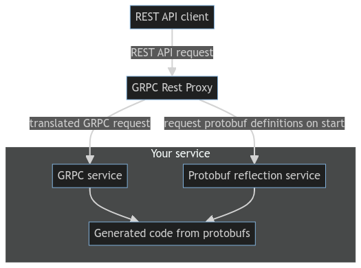

# GRPC REST Proxy
Copyright © ESET 2024-2028

Service that is automatically translating REST requests to gRPC and sending them to provided endpoint. REST is defined using [Google's proto HTTP annotation](https://github.com/googleapis/googleapis/blob/master/google/api/http.proto). Our implementation is able to load proto descriptors directly from grpc endpoint using server reflection service. Main advantage of this approach is elimination of the need to recompile protobufs or grpc-rest-proxy (to incorporate changes in protos), making translation and maintenance easier.

<p align="center">

</p>

## How to build
#### Build main service
```bash
make build
```

## Usage
For more information see:  [config-example.yaml](./config-example.yaml) or [cmd/service/main.go](./cmd/service/main.go).

#### Available parameters
```
Usage of ./grpc-rest-proxy:
  -c, --config string                                      path to config file
      --descriptors.remote.exclude stringArray             remote descriptors to exclude (default [grpc.health.v1.Health,grpc.reflection.v1.ServerReflection])
      --descriptors.remote.reflectionServiceName string    reflection service name (default "grpc.reflection.v1.ServerReflection/ServerReflectionInfo")
      --descriptors.remote.timeout duration                request timeout for remote descriptors (default 1m0s)
      --gateways.grpc.client.requestTimeout duration       requests timeout (default 5s)
      --gateways.grpc.client.targetAddr string             address and port of the gRPC server (default "0.0.0.0:50051")
      --gateways.grpc.client.tls                           use TLS for gRPC connection
      --gateways.grpc.client.tlsSkipverify                 skip TLS verification
      --gateways.grpc.requestTimeout duration              client request timeout (default 5s)
      --transport.http.maxRequestSizeKB uint               maximum size of requests in KB (default 10024)
      --transport.http.requestTimeout duration             request timeout (default 5s)
      --transport.http.server.addr string                  address and port of the HTTP server (default "0.0.0.0:8080")
      --transport.http.server.gracefulTimeout duration     graceful timeout (default 5s)
      --transport.http.server.readHeaderTimeout duration   read header timeout (default 5s)
      --transport.http.server.readTimeout duration         read timeout (default 10s)
  -v, --version                                            print version
```

#### Precedence of configuration items:
1. command line args
2. config file
3. default flags

All default values can be found in [cmd/service/main.go](./cmd/service/main.go).

## How to load protobuf definitions
Two methods are currently supported: remote proto reflection server or local storage.
Remote proto reflection server is used as default method when no other is specified by configuration or parameters.

### Remote proto reflection server
During startup, proto descriptors will be downloaded from endpoint specified in `gateways` section. Default endpoint address is `0.0.0.0:50051`.
```yaml
descriptors:
  kind: remote
  remote:
    # overall timeout for connecting and loading all definitions
    timeout: 1m 
    reflectionServiceName: grpc.reflection.v1.ServerReflection/ServerReflectionInfo
    # which services we want to exclude from parsing (making them private)
    exclude:
      - grpc.health.v1.Health
      - grpc.reflection.v1.ServerReflection
      - grpc.reflection.v1alpha.ServerReflection
```

Proto reflection is allowed by adding following lines: 

```diff
    import (
        "fmt"
	    "net"
	    logging "log/slog"

	    jErrors "github.com/juju/errors"
	    "github.com/spf13/pflag"
	    "google.golang.org/grpc"
+       "google.golang.org/grpc/reflection" 

	    pb "github.com/eset/grpc-rest-proxy/cmd/examples/grpcserver/gen/user/v1"
 )

 func newServer() *grpc.Server {
	grpcServer := grpc.NewServer()
	pb.RegisterUserServiceServer(grpcServer, NewUserService())
	// Register reflection service on gRPC server.
+	reflection.Register(grpcServer)
	return grpcServer
}
```


### Local storage
Local directory will be recursively searched during startup for compiled proto descriptors (file extension `.desc`).
```yaml
descriptors:
  kind: "local"
  local:
    dir: "/var/opt/myprotos/"
```

## Run as Sidecar
You can run grpc-rest-proxy as a sidecar along with grpc service. All you need to do is supply image with configuration and update deployment of your service.

Advantages of sidecar:
- Loaded proto definitions in gateway will always match service's.
- Compatible with cannary releases.
- Gateway's lifetime is tied to service, thus easier to manage.

**Gateway must be set to load from remote proto repository. In this mode, it will automatically load all definitions from targeted endpoints in its configuration. Example: [config-sidecar.yaml](config-sidecar.yaml).**

Example of Kubernetes deployment:
```yaml
apiVersion: apps/v1
kind: Deployment
metadata:
  name: example-service
spec:
  replicas: 4
  template:
    metadata:
    spec:
      containers:
        # main service with enabled grpc reflection
        - name: service 
          image: "example-service:latest"
          command:
            - "/app/example-service"
          ports:
            - name: grpc-port
              containerPort: 50051
        # gateway that will connnect to service
        - name: grpc-gateway-service 
          image: "grpc-gateway:latest" # provider your own image
          command:
            - "/app/grpc-gateway"
          args:
            - "--gateways.grpc.client.targetAddr=127.0.0.1:50051"
          ports:
            - name: web-port
              containerPort: 8080
```